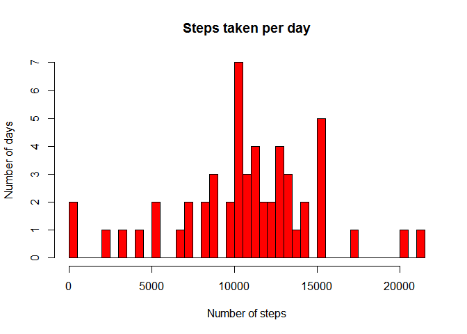
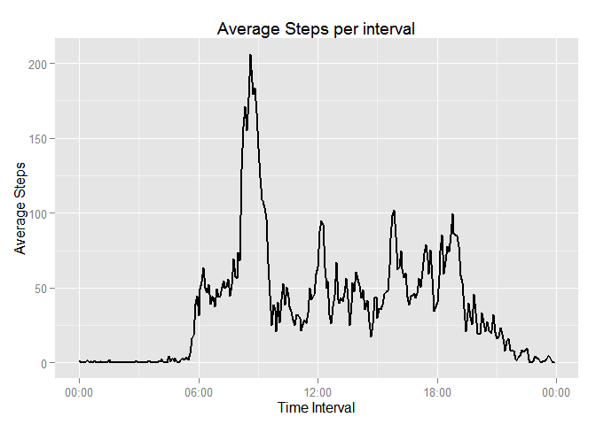
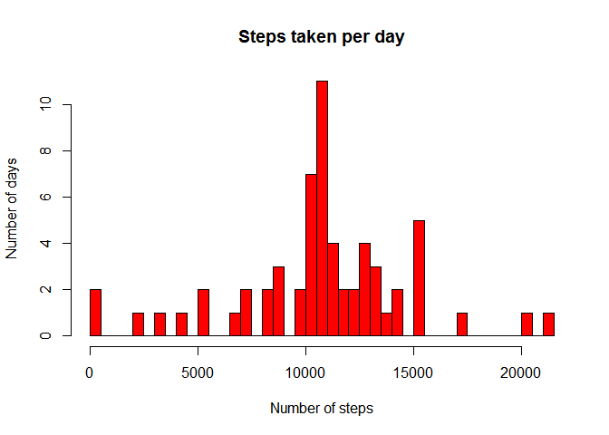
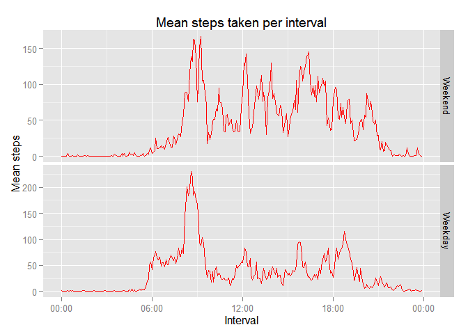

# Reproducible Research: Peer Assessment 1


## Loading and preprocessing the data
Data file was forked from Roger Peng's [github repository][1] on Saturday May 9th 2015 at 7:53 p.m PDT.
It is forked into authors [github repository][2] and is available publicly.

Raw data is loaded into R and explored for any missing data.


```r
if (!file.exists('activity.csv'))
  unzip('activity.zip')
raw_data <- read.csv('activity.csv')
summary(raw_data)
```

```
##      steps                date          interval     
##  Min.   :  0.00   2012-10-01:  288   Min.   :   0.0  
##  1st Qu.:  0.00   2012-10-02:  288   1st Qu.: 588.8  
##  Median :  0.00   2012-10-03:  288   Median :1177.5  
##  Mean   : 37.38   2012-10-04:  288   Mean   :1177.5  
##  3rd Qu.: 12.00   2012-10-05:  288   3rd Qu.:1766.2  
##  Max.   :806.00   2012-10-06:  288   Max.   :2355.0  
##  NA's   :2304     (Other)   :15840
```

```r
clean_data <- raw_data[complete.cases(raw_data$steps),]
```

Each observation has three variables. Number of steps taken, the date and the five minute interval in the
day. Since there are days and intervals with missing data, for initial analysis, these measurements are ignored (excluded) as specified in the assignment.


## What is mean total number of steps taken per day?
To plot a histogram of number of steps taken per day, data is grouped by day and steps are summed over these groups. Following is a histogram of number of steps taken per day.


```r
stepsPerDay <- tapply(clean_data$steps, as.character(clean_data$date), sum)
stepsPerDay <- as.numeric(stepsPerDay)
hist(stepsPerDay, breaks = 50, col = 'red',
     main = 'Steps taken per day', xlab = 'Number of steps', ylab = 'Number of days')
```

 

Mean and Median of number of steps taken per day are as follows


```r
m <- mean(stepsPerDay)
paste('Mean: ',m)
```

```
## [1] "Mean:  10766.1886792453"
```

```r
m <- median(stepsPerDay)
paste('Median: ',m)
```

```
## [1] "Median:  10765"
```


## What is the average daily activity pattern?
Next we try to visualize daily activity pattern to understand which 5 minute intervals during the day are more active than the others.  

Intervals are represented in **MMHH** format with leading zeros removed and represented as an integer.
To make properly visualize the time scale, a date object is constructed restoring leading zeros. To obtain
average steps per interval, average number of steps is calculated over all days grouped by interval. Time
transformations are applied to the result and visualized with X-axis showing the time and Y-axis showing
average number of steps taken in that interval.


```r
require('ggplot2')
require('scales')
stepsPerInt <- tapply(clean_data$steps, clean_data$interval, mean)
intervals <- names(stepsPerInt)
steps <- as.numeric(stepsPerInt)
stepsPerInt <- data.frame(intervals = as.numeric(as.character(intervals)), meanSteps = steps)
stepsPerInt$timeonly <- sprintf("%04d", stepsPerInt$intervals)
stepsPerInt$timeonly <- strptime(stepsPerInt$timeonly, "%H%M")
plot <- ggplot()
plot <- plot + geom_line(mapping=aes(x=timeonly, y=meanSteps), data = stepsPerInt, size = 1)
plot <- plot + xlab("Time Interval") + ylab("Average Steps") +
  scale_x_datetime(labels = date_format("%H:%M"))
plot + ggtitle("Average Steps per interval")
```

 

Now we determine the most active five minute interval across all days.


```r
bestInterval <- with(stepsPerInt, intervals[which.max(meanSteps)])
paste('Interval with most average steps across all days is :', sprintf('%04d',bestInterval))
```

```
## [1] "Interval with most average steps across all days is : 0835"
```

## Imputing missing values
After initial analysis, it is time to build a more accurate model/result by imputing missing values.
Looking at the raw data, there are misssing values for number of steps taken.


```r
colSums(is.na(raw_data))
```

```
##    steps     date interval 
##     2304        0        0
```

Imputing missing steps with average number of steps taken during the same interval across the days on which the values is available seems more appropriate than the daily average number of steps.


```r
impute_data <- raw_data
impute_data$interval <- as.character(impute_data$interval)
stepsPerInt <- tapply(clean_data$steps, clean_data$interval, mean)
impute_data$steps[is.na(impute_data$steps)] <- 
  stepsPerInt[impute_data$interval[is.na(impute_data$steps)]]
colSums(is.na(impute_data))
```

```
##    steps     date interval 
##        0        0        0
```

Following are the new histogram and daily mean and median after missing values are imputed.


```r
imputeStepsPerDay <- tapply(impute_data$steps, as.character(impute_data$date), sum)
imputeStepsPerDay <- as.numeric(imputeStepsPerDay)
hist(imputeStepsPerDay, breaks = 50, col = 'red',
     main = 'Steps taken per day', xlab = 'Number of steps', ylab = 'Number of days')
```

 

Mean, Median and total number of steps taken per day before and after imputing are as follows


###Before imputing

```r
mn <- mean(stepsPerDay)
md <- median(stepsPerDay)
paste('Mean: ',mn)
```

```
## [1] "Mean:  10766.1886792453"
```

```r
paste('Median: ',md)
```

```
## [1] "Median:  10765"
```

###After imputing

```r
mn <- mean(stepsPerDay)
md <- median(stepsPerDay)
paste('Mean: ',mn)
```

```
## [1] "Mean:  10766.1886792453"
```

```r
paste('Median: ',md)
```

```
## [1] "Median:  10765"
```

###Effect of imputing on the result
  
  
1. Mean: For every interval, we have imputed the average number of steps for that interval. So, for each day added with imputed value, the total number of steps is same as the average
    * Hence the average has not changed before and after imputing
    * Note: This result will be different for students who subtituted '0' for missing values before imputing.
  I have chosen to remove them instead of replacing with '0'
2. Median: New days added with imputed values fall around the average region. Hence it is likely median is one of the newly added days
    * Very likely the new median is one of the imputed days and hence median is same as mean
3. Steps Per Day: Imputing had no effect on total number of steps taken per day. Histogram has more days around mean
  
  
**Please note: These results will be different for students who interpreted ignore NAs as replacing NAs with 0. I interpreted ignore NAs as ignore them. For those students, it is likely averages went up.**

## Are there differences in activity patterns between weekdays and weekends?
Imputed data is processed to have a date/time column and a factor variable indicating if an observation is for weekday or not.

For this excersise, data must be grouped by day and also by type of the day i.e., it is a weekday or a weekend. Number of steps in each of these groups is averaged and using ggplot a panel is plotted with average number of steps per interval for weekday and weekend.


```r
require('dplyr')
proc_data <- impute_data
proc_data$interval <- as.integer(proc_data$interval)
time <- sprintf('%04d', proc_data$interval)
datetime <- paste(proc_data$date,time)
proc_data$datetime <- strptime(datetime, '%Y-%m-%d %H%M')
proc_data$day <- weekdays(proc_data$datetime)
proc_data$daytype <- as.factor(!(proc_data$day %in% c('Sunday', 'Saturday')))
levels(proc_data$daytype) <- c('Weekend','Weekday')

group <- group_by(subset(proc_data, select = -c(datetime)), interval, daytype)
result <- as.data.frame(summarise(group, mean(steps)))
names(result) <- c('interval','daytype','meanSteps')
result$timeonly <- sprintf("%04d", result$interval)
result$timeonly <- strptime(result$timeonly, "%H%M")

plot <- ggplot()
plot <- plot + geom_line(data=result, aes(x=timeonly,y=meanSteps), col='red') + facet_grid(daytype ~ ., scales = "free")
plot <- plot + scale_x_datetime(labels = date_format("%H:%M")) + xlab('Interval') + ylab('Mean steps')
plot + ggtitle('Mean steps taken per interval')
```

 


[1]: https://github.com/rdpeng/RepData_PeerAssessment1 "github repository"
[2]: https://github.com/ai2160/RepData_PeerAssessment1 "github repository"
